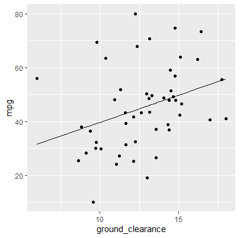
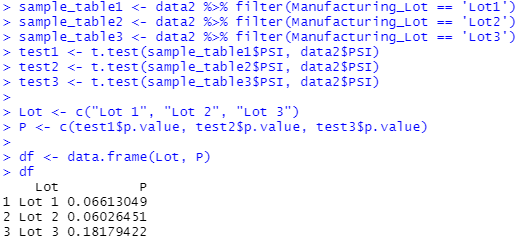
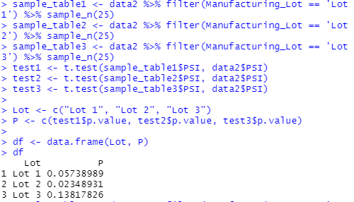
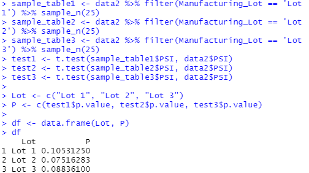

# MechaCar_Statistical_Analysis
### Miguel Fidelino

## Linear Regression to Predict MPG
Vehicle length and ground clearance are the most significant factors that affect MPG. Interestingly, the weight of the car does not pass the significance level of 5%, but comes very close. Here are a sample of the adjacent significant values (<10%).  
                   Estimate Std. Error t value Pr(>|t|)  
(Intercept)      -1.040e+02  1.585e+01  -6.559 5.08e-08  
vehicle_length    6.267e+00  6.553e-01   9.563 2.60e-12  
vehicle_weight    1.245e-03  6.890e-04   1.807   0.0776  
ground_clearance  3.546e+00  5.412e-01   6.551 5.21e-08  

The slope of the linear model will not be considered zero unless there is absolutely no correlation between the two. In our case, no linear regression model has a slope of zero. 

MechaCar has the strongest relationship with the vehicle length.

The linear regression model has a defined upward trend in terms of vehicle_length and mpg. This is also true for ground clearance and mpg:

If our significance level was above 5%, vehicle weight would play a factor in determining what best affects MPG. This is only if we have different models of different sizes, but the majority of the time, it's going to be minute differences between prototypes.

The linear regression model is a good indicator of our prototypes. It shows the
 relationship between the data effectively and to what degree. Given that all the MechaCar prototypes would be almost the same car with a few minute differences, the model can point out the effect of those changes.

## Summary Statistics on Suspension Coils

The total summary of all the lots:

Summary by Lot:

Lots one and two meet the design specification. Lot 3 does not, as the variance can go up to 170 PSI.

## T-Tests on Suspension Coils

After running a one-tailed T-Test for the population and a sample of 50, there does not appear to be any significant changes to the difference of means.

This is true as well for all lots, as none pass the significance level of %5.

If we were to sample by lot, Lot 3 has the greatest difference in mean value after running 3 tests using a sample of 25 in the same lot: 

There has been no change in the mean, meaning that Lot 3 still has greater variance than all other lots.

## Study Design: MechaCar vs Competition

MechaCar could be compared to it's competitors by asking the following questions:
    
1. Is MechaCar more fuel efficient?

    H0: MechaCar is not as fuel efficient.
    Ha: MechaCar is at least 5% more fuel efficient.

    We can sample using Miles per Galon as the main comparison. A One-Sampled T-Test to compare MechaCar to the total average of the competitors. Significance level of 10% will be used. A One-Sampled T-Test is used as we are comparing our MechaCar to the average of the competitors. For this test, we would require competitor data on their equivalent car's MPG. 
    
2. How does MechaCar's safety rating compare?

    We can obtain relevant information by comparing safety ratings from multiple editorials.

    H0: MechaCar is as safe as other similar models.
    Ha: MechaCar safety ratings are 5% higher than other similar models.

    We can compare safety ratings of MechaCar to other models using exerpts and reviews from other editorials. A Chi-Squared test can be used to compare reviews that use words, and can categorize them as "positive" or "negative", allowing us to be able to quantify the reviews better.
